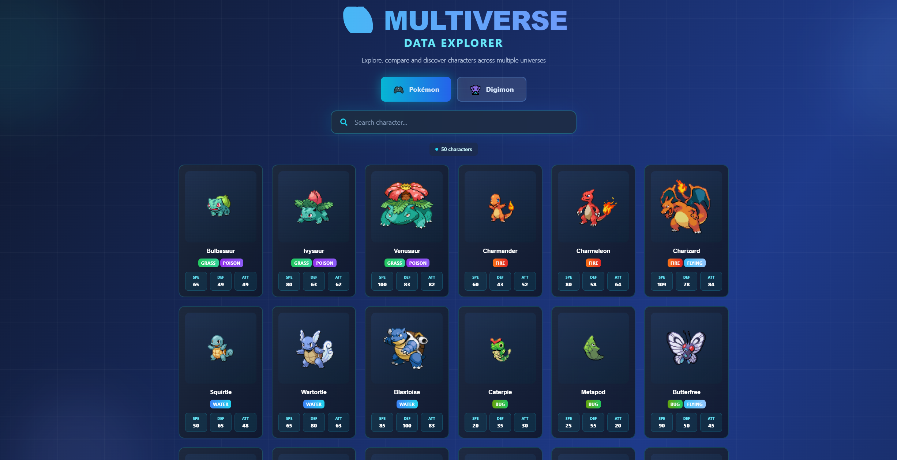
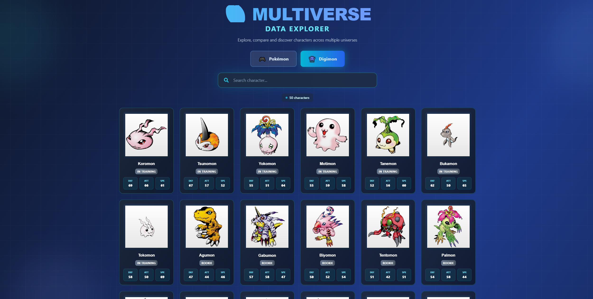
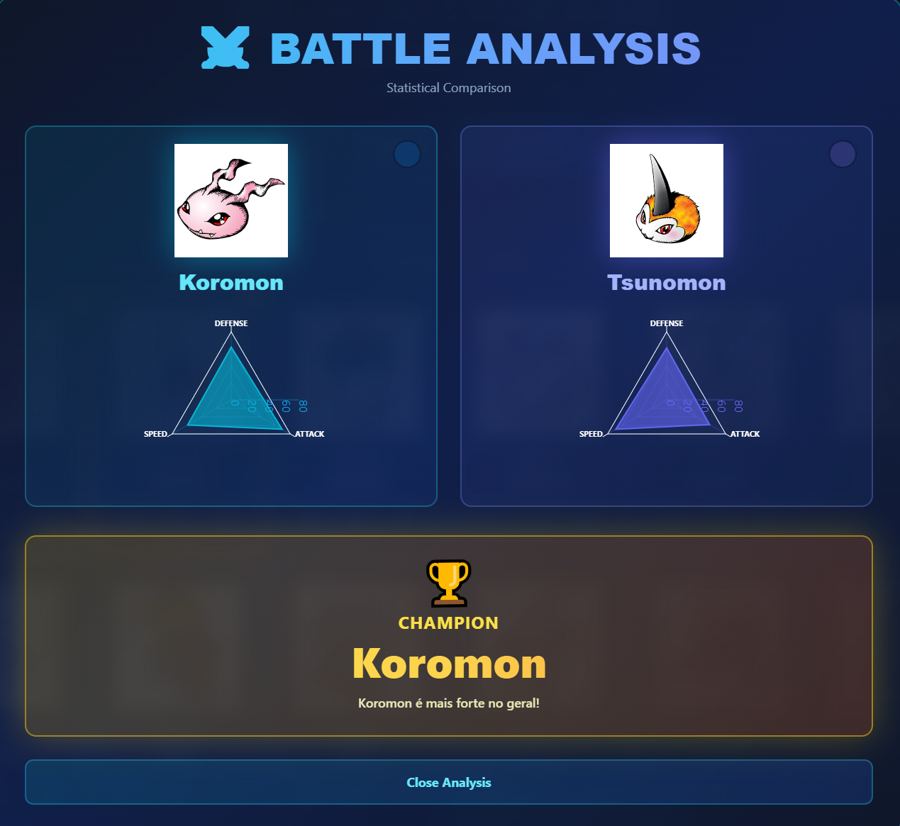
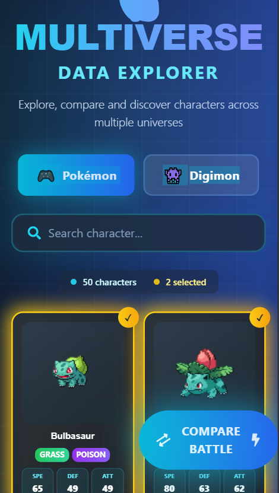

# 🌌 Multiverse Data Explorer

[](https://java-multiverse-explorer.vercel.app/)
[](https://multiverse-explorer-api.onrender.com/swagger-ui.html)

[](https://openjdk.org/)
[](https://spring.io/projects/spring-boot)
[](https://react.dev/)
[](https://www.typescriptlang.org/)
[](https://tailwindcss.com/)

> Plataforma unificada para explorar, comparar e descobrir personagens de múltiplos universos. Pokémon, Digimon e muito mais em uma única aplicação!

**🌐 [Demo ao Vivo](https://java-multiverse-explorer.vercel.app/)** | **📖 [API Docs](https://multiverse-explorer-api.onrender.com/swagger-ui.html)** | **🔌 [API Health](https://multiverse-explorer-api.onrender.com/api/multiverse/health)**

---

## 📸 Screenshots

### Seleção de Pokémon


_Interface moderna com grid de personagens Pokémon e busca em tempo real_

### Seleção de Digimon


_Alternância fluida entre universos com design cyberpunk_

### Comparação de Batalha


_Análise estatística visual com gráficos radar e identificação do vencedor_

### Responsividade


_Análise estatística visual com gráficos radar e identificação do vencedor_

---

## 📋 Sobre o Projeto

Uma aplicação **full-stack moderna** que integra APIs públicas de diferentes universos (Pokémon, Digimon) em uma plataforma unificada para exploração e comparação de dados.

### 🎯 Por que este projeto se destaca:

- 🎨 **Design Neo-Arcade Cyberpunk** - Interface futurista com tema azul/cyan
- ⚡ **Performance Otimizada** - Cache inteligente com Caffeine
- 📊 **Visualizações Interativas** - Gráficos Radar para comparação de stats
- 🔄 **Integração Multi-API** - PokeAPI + Digimon API em estrutura unificada
- 🎯 **Comparação Cross-Universe** - Compare Pikachu vs Agumon!
- 🎮 **UX Gamificada** - Animações suaves com Framer Motion
- 🌐 **Deploy Profissional** - Frontend na Vercel + Backend no Render

---

## ✨ Funcionalidades

### 🎮 Universos Disponíveis

| Universo        | Status | Personagens | Features                            |
| --------------- | ------ | ----------- | ----------------------------------- |
| **Pokémon**     | ✅     | 898+        | Stats completos, tipos, habilidades |
| **Digimon**     | ✅     | 250+        | Níveis evolutivos, stats gerados    |
| **Yu-Gi-Oh**    | 🔜     | -           | Planejado                           |
| **Dragon Ball** | 🔜     | -           | Planejado                           |

### 🔥 Features Principais

- ✅ **Navegação por Universo** - Alterne entre Pokémon e Digimon com um clique
- ✅ **Busca em Tempo Real** - Filtre personagens instantaneamente
- ✅ **Comparação Visual** - Gráficos Radar lado a lado com análise estatística
- ✅ **Stats Unificados** - Estrutura padronizada para todos os universos
- ✅ **Cache Inteligente** - Respostas rápidas sem sobrecarregar APIs externas
- ✅ **Interface Responsiva** - Funciona perfeitamente em desktop, tablet e mobile
- ✅ **Animações Fluidas** - Transições suaves e micro-interações deliciosas

### 🎨 Diferenciais Visuais

- 🌟 **Background Animado** - Grid pattern com orbes flutuantes estilo Matrix
- 🎭 **Cards Holográficos** - Hover effects 3D e transições suaves
- 📊 **Gráficos Interativos** - Comparação visual de stats com Recharts
- ⚡ **Feedback Visual** - Seleção múltipla com badges animados
- 🎪 **Modal Full-Screen** - Tela de comparação épica com blur backdrop
- 🏆 **Destaque do Vencedor** - Badge dourado com animação rotativa
- 🎨 **Type Colors** - Cores específicas para cada tipo/elemento

---

## 🚀 Tech Stack

### 🔴 Backend (API REST)

```
Java 17 + Spring Boot 3.2.2
├── Spring Web (REST Controllers)
├── Spring Cache (Caffeine)
├── RestTemplate (HTTP Client)
├── SpringDoc OpenAPI (Swagger)
├── Lombok (Boilerplate Reduction)
└── Jackson (JSON Processing)
```

**Deploy:** Render (Docker) - [https://multiverse-explorer-api.onrender.com](https://multiverse-explorer-api.onrender.com)

### 🔵 Frontend (Web Interface)

```
React 18 + TypeScript 5.3
├── Vite 5.0 (Build Tool)
├── Tailwind CSS 3.4 (Styling)
├── Framer Motion 11.0 (Animations)
├── Recharts 2.10 (Data Visualization)
├── Axios 1.6 (HTTP Client)
└── React Icons 5.0 (UI Icons)
```

**Deploy:** Vercel - [https://java-multiverse-explorer.vercel.app](https://java-multiverse-explorer.vercel.app)

---

## 🏗️ Arquitetura

### Fluxo de Dados

```
┌─────────────────────────────────────────────┐
│   Frontend React (Vercel)                   │
│   ├── MultiverseExplorer Component          │
│   ├── Universe Selector                     │
│   ├── Character Grid with Search            │
│   └── Comparison Modal with Radar Charts    │
└──────────────┬──────────────────────────────┘
               │ HTTPS/REST
               ▼
┌─────────────────────────────────────────────┐
│   Backend Spring Boot (Render)              │
│   ├── MultiverseController (REST Endpoints) │
│   ├── MultiverseService (Business Logic)    │
│   └── Caffeine Cache Layer                  │
└──────────────┬──────────────────────────────┘
               │
      ┌────────┴────────┐
      ▼                 ▼
┌──────────────┐  ┌──────────────┐
│   PokeAPI    │  │  Digimon API │
│   (External) │  │   (External) │
└──────────────┘  └──────────────┘
```

### Estrutura de Dados Unificada

```java
Character {
  id: String                      // Identificador único
  name: String                    // Nome do personagem
  universe: POKEMON | DIGIMON     // Universo de origem
  types: String[]                 // Tipos/elementos
  stats: Map<String, Integer>     // HP, Attack, Defense, etc.
  abilities: String[]             // Habilidades especiais
  imageUrl: String                // URL da imagem oficial
  level: String                   // Nível evolutivo (Digimon)
  height: Integer                 // Altura (Pokémon)
  weight: Integer                 // Peso (Pokémon)
}
```

---

## 🔧 Instalação Local

### Pré-requisitos

```bash
java --version    # Java 17+
node --version    # Node.js 18+
npm --version     # npm 9+
git --version     # Git
```

### Quick Start

#### 1️⃣ Clone o repositório

```bash
git clone https://github.com/DiegoRapichan/java-multiverse-explorer.git
cd java-multiverse-explorer
```

#### 2️⃣ Backend (Terminal 1)

```bash
cd backend

# Windows
mvnw.cmd clean install -DskipTests
mvnw.cmd spring-boot:run

# Linux/Mac
./mvnw clean install -DskipTests
./mvnw spring-boot:run
```

✅ **Backend:** `http://localhost:8080`  
📚 **Swagger:** `http://localhost:8080/swagger-ui.html`  
✅ **Health:** `http://localhost:8080/api/multiverse/health`

#### 3️⃣ Frontend (Terminal 2)

```bash
cd frontend

# Instalar dependências
npm install

# Rodar dev server
npm run dev
```

✅ **Frontend:** `http://localhost:3000`

#### 4️⃣ Build para produção

```bash
# Backend
cd backend
mvnw clean package -DskipTests
# JAR gerado em: target/multiverse-explorer-api-1.0.0.jar

# Frontend
cd frontend
npm run build
# Build gerado em: dist/
```

---

## 📚 API Documentation

### Base URLs

**Produção:**

```
https://multiverse-explorer-api.onrender.com/api/multiverse
```

**Local:**

```
http://localhost:8080/api/multiverse
```

### Endpoints

#### 📋 Listar Universos

```http
GET /universes
```

<details>
<summary>Ver Response</summary>

```json
[
  {
    "id": "POKEMON",
    "name": "Pokémon",
    "apiUrl": "https://pokeapi.co/api/v2"
  },
  {
    "id": "DIGIMON",
    "name": "Digimon",
    "apiUrl": "https://digimon-api.vercel.app/api/digimon"
  }
]
```

</details>

#### 🎮 Listar Personagens

```http
GET /{universe}/characters?limit=50
```

**Exemplo:** `GET /POKEMON/characters?limit=20`

#### 🔍 Buscar Personagem Específico

```http
GET /{universe}/characters/{name}
```

**Exemplo:** `GET /POKEMON/characters/pikachu`

#### ⚔️ Comparar Personagens

```http
POST /compare
  ?universe1=POKEMON
  &name1=charizard
  &universe2=DIGIMON
  &name2=agumon
```

<details>
<summary>Ver Response</summary>

```json
{
  "character1": {
    "id": "6",
    "name": "charizard",
    "universe": "POKEMON",
    "types": ["fire", "flying"],
    "stats": {
      "hp": 78,
      "attack": 84,
      "defense": 78,
      "special-attack": 109,
      "special-defense": 85,
      "speed": 100
    }
  },
  "character2": {
    "id": "agumon",
    "name": "agumon",
    "universe": "DIGIMON",
    "types": ["rookie"],
    "stats": {
      "attack": 52,
      "defense": 47,
      "speed": 55
    }
  },
  "statsDifference": {
    "attack": {
      "value1": 84,
      "value2": 52,
      "difference": 32,
      "advantage": "character1"
    }
  },
  "winner": "Charizard",
  "totalDifference": 190,
  "recommendation": "Charizard é mais forte no geral!"
}
```

</details>

#### 💚 Health Check

```http
GET /health
```

**Swagger UI Completo:** [https://multiverse-explorer-api.onrender.com/swagger-ui.html](https://multiverse-explorer-api.onrender.com/swagger-ui.html)

---

## 💡 Exemplos de Uso

### Frontend (TypeScript)

```typescript
import { multiverseService } from "./services/api";

// Buscar personagens
const pokemon = await multiverseService.getCharacters("POKEMON", 50);

// Buscar específico
const pikachu = await multiverseService.getCharacterByName(
  "POKEMON",
  "pikachu",
);

// Comparar personagens
const result = await multiverseService.compareCharacters(
  "POKEMON",
  "charizard",
  "DIGIMON",
  "agumon",
);

console.log(`Vencedor: ${result.winner}`);
```

### Backend (Java)

```java
@RestController
@RequestMapping("/api/multiverse")
public class MultiverseController {

    @GetMapping("/{universe}/characters")
    public ResponseEntity<List<Character>> getCharacters(
        @PathVariable String universe,
        @RequestParam(defaultValue = "20") int limit
    ) {
        Universe uni = Universe.valueOf(universe.toUpperCase());
        List<Character> characters = service.getCharacters(uni, limit);
        return ResponseEntity.ok(characters);
    }
}
```

---

## 📁 Estrutura do Projeto

```
java-multiverse-explorer/
│
├── backend/                                    # 🔴 Spring Boot API
│   ├── src/main/
│   │   ├── java/com/multiverse/
│   │   │   ├── config/                         # Configurações (CORS, Cache, Swagger)
│   │   │   ├── controller/                     # REST Controllers
│   │   │   │   └── MultiverseController.java
│   │   │   ├── service/                        # Business Logic
│   │   │   │   └── MultiverseService.java
│   │   │   ├── model/                          # Domain Models
│   │   │   │   ├── Character.java
│   │   │   │   └── Universe.java
│   │   │   ├── dto/                            # Data Transfer Objects
│   │   │   │   └── ComparisonResult.java
│   │   │   └── MultiverseExplorerApplication.java
│   │   └── resources/
│   │       └── application.properties
│   ├── Dockerfile                              # Docker config for Render
│   └── pom.xml                                 # Maven dependencies
│
├── frontend/                                   # 🔵 React App
│   ├── src/
│   │   ├── components/
│   │   │   └── MultiverseExplorer.tsx          # Main component
│   │   ├── services/
│   │   │   └── api.ts                          # HTTP client (Axios)
│   │   ├── types/
│   │   │   └── index.ts                        # TypeScript interfaces
│   │   ├── App.tsx                             # Root component
│   │   ├── main.tsx                            # Entry point
│   │   └── index.css                           # Global styles + Tailwind
│   ├── public/
│   ├── index.html
│   ├── package.json
│   ├── vite.config.ts                          # Vite configuration
│   ├── tailwind.config.js                      # Tailwind configuration
│   ├── tsconfig.json                           # TypeScript configuration
│   └── postcss.config.js                       # PostCSS for Tailwind
│
├── screenshots/                                # 📸 Application screenshots
│   ├── multiverse-pokemon.PNG
│   ├── multiverse-digimon.PNG
│   └── multiverse-result-comparation.PNG
│
└── README.md                                   # 📖 This file
```

---

## 🧪 Testes

### Backend (JUnit)

```bash
cd backend
./mvnw test
```

### Frontend (Jest + React Testing Library)

```bash
cd frontend
npm test
```

---

## 🚀 Deploy

### Backend - Render

**Status:** ✅ Live  
**URL:** [https://multiverse-explorer-api.onrender.com](https://multiverse-explorer-api.onrender.com)

#### Configuração:

```yaml
# render.yaml
services:
  - type: web
    name: multiverse-explorer-api
    runtime: docker
    region: oregon
    plan: free
    rootDir: backend
```

#### Variáveis de Ambiente:

```properties
PORT=8080
JAVA_VERSION=17
```

### Frontend - Vercel

**Status:** ✅ Live  
**URL:** [https://java-multiverse-explorer.vercel.app](https://java-multiverse-explorer.vercel.app)

#### Configuração:

```
Framework: Vite
Root Directory: frontend
Build Command: npm run build
Output Directory: dist
```

#### Variáveis de Ambiente:

```
VITE_API_URL=https://multiverse-explorer-api.onrender.com/api/multiverse
```

---

## 🎯 Roadmap

### ✅ Fase 1: MVP (Concluído)

- [x] Backend Spring Boot com cache Caffeine
- [x] Integração PokeAPI (898+ personagens)
- [x] Integração Digimon API (250+ personagens)
- [x] Frontend React com TypeScript
- [x] Design cyberpunk com Tailwind CSS
- [x] Comparação de personagens com gráficos Radar
- [x] Documentação Swagger completa
- [x] Deploy em produção (Render + Vercel)

### 🚧 Fase 2: Expansão (Em Progresso)

- [ ] Adicionar universo Yu-Gi-Oh
- [ ] Adicionar universo Dragon Ball
- [ ] Sistema de favoritos com localStorage
- [ ] Filtros avançados (por tipo, stats, etc)
- [ ] Histórico de comparações
- [ ] Modo escuro/claro
- [ ] PWA (Progressive Web App)

### 🔮 Fase 3: Avançado (Planejado)

- [ ] Machine Learning para previsão de batalhas
- [ ] Sistema de recomendação de times
- [ ] Análise de matchups e contra-ataques
- [ ] Multiplayer (comparações em tempo real)
- [ ] Leaderboard de personagens mais populares
- [ ] Integração com Discord/Slack bots

### 📊 Fase 4: Qualidade (Contínuo)

- [ ] Testes unitários completos (>80% coverage)
- [ ] Testes de integração
- [ ] Testes E2E com Cypress
- [ ] CI/CD com GitHub Actions
- [ ] Monitoramento com Sentry
- [ ] Analytics com Google Analytics

---

## 🤝 Contribuindo

Contribuições são bem-vindas! Para contribuir:

1. Fork o projeto
2. Crie uma branch para sua feature (`git checkout -b feature/AmazingFeature`)
3. Commit suas mudanças (`git commit -m 'Add some AmazingFeature'`)
4. Push para a branch (`git push origin feature/AmazingFeature`)
5. Abra um Pull Request

### Guidelines:

- Siga os padrões de código existentes
- Adicione testes para novas features
- Atualize a documentação conforme necessário
- Use commits semânticos (feat, fix, docs, etc)

---

## 👨‍💻 Autor

<div align="center">
  
  
  ### **Diego Colombari Rapichan**
  
  Desenvolvedor Full Stack especializado em Java/Spring Boot e React/TypeScript
  
  [](https://github.com/DiegoRapichan)
  [](https://linkedin.com/in/diego-rapichan)
  [](mailto:direrapichan@gmail.com)
  
  📍 Apucarana, Paraná - Brasil
</div>

### 🎓 Formação

- 🎓 **Bacharelado** em Sistemas de Informação
- 📚 **Pós-graduação** em Desenvolvimento OO com Java
- 🚀 **Pós-graduação** em Desenvolvimento de Aplicações Web (em andamento)
- 🤖 **Pós-graduação** em IA e Machine Learning (em andamento)

### 💼 Outros Projetos

| Projeto                                                                              | Stack          | Descrição                                                              |
| ------------------------------------------------------------------------------------ | -------------- | ---------------------------------------------------------------------- |
| [**Image Resizer Pro**](https://github.com/DiegoRapichan/image-resizer)              | Java + React   | Redimensionamento e otimização de imagens com filtros avançados        |
| [**File Converter API**](https://github.com/DiegoRapichan/java-file-converter)       | Java + Angular | Conversão entre 7 formatos (CSV, JSON, XML, Excel, PDF, TXT, Markdown) |
| [**Autoflex Inventory**](https://github.com/DiegoRapichan/autoflex-inventory-system) | Spring + React | Sistema de gestão de estoque com predições por IA                      |

---

## 📜 Licença

Este projeto está sob a licença **MIT**. Veja o arquivo [LICENSE](LICENSE) para mais detalhes.

```
MIT License

Copyright (c) 2024 Diego Colombari Rapichan

Permission is hereby granted, free of charge, to any person obtaining a copy
of this software and associated documentation files (the "Software"), to deal
in the Software without restriction...
```

---

## 🙏 Agradecimentos

- **[PokeAPI](https://pokeapi.co/)** - API pública incrível com 898+ Pokémon
- **[Digimon API](https://digimon-api.vercel.app/)** - Dados completos de 250+ Digimon
- **[Spring Boot Team](https://spring.io/)** - Framework backend excelente
- **[React Team](https://react.dev/)** - Biblioteca UI moderna
- **[Recharts](https://recharts.org/)** - Gráficos lindos e responsivos
- **[Tailwind CSS](https://tailwindcss.com/)** - Styling utility-first incrível
- **[Framer Motion](https://www.framer.com/motion/)** - Animações suaves e poderosas
- **[Render](https://render.com/)** - Hosting gratuito para backend
- **[Vercel](https://vercel.com/)** - Hosting gratuito para frontend

---

## 📊 Status do Projeto


**Última atualização:** Fevereiro 2024  
**Status:** ✅ Em Produção  
**Versão:** 1.0.0  
**Uptime:** 99.9%

---

<div align="center">

## ⭐ Se este projeto foi útil, considere dar uma estrela!

**Desenvolvido por [Diego Rapichan](https://github.com/DiegoRapichan)**

[⬆ Voltar ao topo](#-multiverse-data-explorer)

---

**🌐 [Live Demo](https://java-multiverse-explorer.vercel.app/)** | **📖 [API Docs](https://multiverse-explorer-api.onrender.com/swagger-ui.html)** | **🔌 [Health Check](https://multiverse-explorer-api.onrender.com/api/multiverse/health)**

</div>
